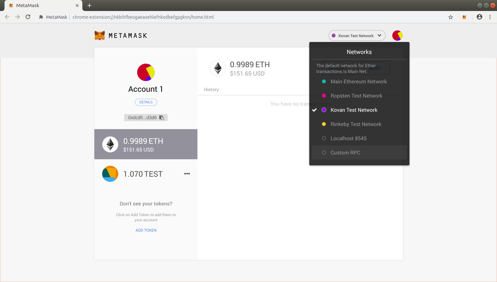

# Connecting to Polygon

### Install Metamask

The easiest way to to interact with the Polygon Network as well as other blockchains is to install Metamask. To find out how to install Metamask head over to [https://metamask.io/](https://metamask.io/) and follow their instructions catered to the device you are using. It is a quick and simple setup process which won't take longer than a few minutes. After you have successfully created a Metamask account, continue with the steps below.

### Configure Polygon on Metamask

To add Polygon’s Mainnet, click on the Network selection dropdown and then click on Custom RPC.

 It will open up a form with 2 tabs on the top, Settings and Info. In the Settings tab you can add `Matic Mainnet` in the Network Name field, URL `https://rpc-mainnet.maticvigil.com/` in the New RPC URL field, `137` in Chain ID field, `MATIC` in Currency Symbol field and `https://polygonscan.com/` in Block Explorer URL field. 

Once you’ve added the information click on Save. You will be directly switched to Polygon’s Mainnet now in the network dropdown list. You can now close the dialog.

